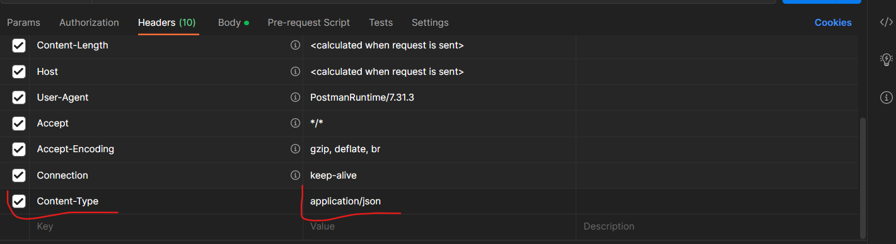

# SIMPLE TO-DO APPLICATION ON MERN WEB STACK DOCUMENTATION

## We will implement a web solution based on MERN stack in AWS Cloud
<br><br>
### **MERN** Web stack consists of following components:

1. **M**ongoDB: A document-based, No-SQL database used to store application data in a form of documents.
2. **E**xpressJS: A server side Web Application framework for Node.js.
3. **R**eactJS: A frontend framework developed by Facebook. It is based on JavaScript, used to build User Interface (UI) components.
4. **N**ode.js: A JavaScript runtime environment. It is used to run JavaScript on a machine rather than in a browser.
### First, we need to do these steps:
1. Create an account on [AWS](https://aws.amazon.com/)
2. Create an instance (virtual machine) by selecting “ubuntu server 20.04 LTS” from Amazon Machine Image(AMI)(free tier).
3. Select “t2.micro(free tier eligible)”
4. On the security group and select “existing security group” review and click **Launch Instance**.
 #### This launches the instance and takes you to the Instances dashboard
 

 5. Then open a terminal on your system and enter the folder where your previously downloaded PEM file is located.

 #### *In this case we use the Git Bash Terminal*
 

 #### 6. Connect to the instance from ubuntu terminal using this command:
 >`ssh -i "Jennee-EC2.pem" ubuntu@ec2-35-176-8-236.eu-west-2.compute.amazonaws.com`

 


 #### *This automatically connects to the instance when you click Enter*
 
<br><br>
 ## BACKEND CONFIGURATION
 ### First, we update ubuntu, using the command:
 >` sudo apt update`

 

 ### Them we upgrade ubuntu, using this command:
 >`sudo apt upgrade`

 

 ### Next, we get the location of Node.js software from Ubuntu repositories, using this command:
 >`curl -fsSL https://deb.nodesource.com/setup_18.x | sudo -E bash -`

 

 ### Then we Install Node.js on the server, using this command:
 >`sudo apt-get install -y nodejs`

 

 #### *The command above installs both **nodejs** and **npm**. NPM is a package manager for Node like apt for Ubuntu, it is used to install Node modules & packages and to manage dependency conflicts.*

 ### We verify the *node* installation with using this command:

 >`node -v`

 

 ### Also Verify the *npm* installation with using this command:

>`npm -v`


#### **Application Code Setup**

### We create a new directory for out To-Do project, using this command:

>`mkdir Todo`

#### Then verify the directory we created, using:
>`ls`


### Next, we change current directory to the newly created one, using this command:

>` cd Todo`

### Next, we initialize the project so that a new file package.json will be created. This file contains information of the application and the dependencies it needs to run.

#### We initialize the project using this command:

>`npm init`

#### *Click **Enter** several times to continue, then select **yes** to complete the process*


### Verify that the package was created, using this command:

>`ls`


### Next we install ExpressJs and create the Routes directory

<br><br>
## INSTALL EXPRESSJS

### To use express, install it using npm, by running this commad:

>`npm install express`


### Next,  create a file index.js using this command:

>` touch index.js`

#### Verify the file has been created, using:

>`ls`


### Next, Install the *dotenv* module, using this command:

>`npm install dotenv`


### Open the index.js file, using this command:

>`vim index.js`

#### And paste this:

```
const express = require('express');
require('dotenv').config();

const app = express();

const port = process.env.PORT || 5000;

app.use((req, res, next) => {
res.header("Access-Control-Allow-Origin", "\*");
res.header("Access-Control-Allow-Headers", "Origin, X-Requested-With, Content-Type, Accept");
next();
});

app.use((req, res, next) => {
res.send('Welcome to Express');
});

app.listen(port, () => {
console.log(`Server running on port ${port}`)
});
```


#### *Click **esc**, then*,
#### Save with:

>`:w`

#### Exit with:

>`:qa`

### Next, we start the server to see if it works, using this command:

>`node index.js`

#### *If everything goes well, you should see **Server running on port 5000** in your terminal.* 


### Now we need to open this port in EC2 Security Groups, Edit Inbound Rules and add rules.


### Open up your browser and try to access your server’s Public IP or Public DNS name followed by port 5000:

>`http://<PublicIP-or-PublicDNS>:5000`

#### If everything is correct, you should see ***Welcome to Express***


<br><br>
####             ***Routes***
### Our To-Do application should be able to do the following

1. Create a new task
2. Display list of all tasks
3. Delete a completed task

#### Each task will be associated with some particular endpoint and will use different standard HTTP request methods: **POST, GET, DELETE**

### *We will create routes that will define various endpoints that the To-do app will depend on*.

### Create a ***routes*** folder, using this command:

>`mkdir routes`


### Now, create a file api.js, using this command:

>`touch api.js`


### Open the api.js file, using:

>` vim api.Js`

### And paste this:

```
`const express = require ('express');
const router = express.Router();
router.get('/todos', (req, res, next) => {
});
router.post('/todos', (req, res, next) => {
});
router.delete('/todos/:id', (req, res, next) => {
})
module.exports = router;
```


#### *Click **esc**, then*,
#### Save with:

>`:w`

#### Exit with:

>`:qa`

--- 
---
<br><br>
## MODELS

### Since the app is going to make use of Mongodb which is a NoSQL database, we need to create a model.

#### To create a Schema and a model, install mongoose into the Todo directory, using this command:
>`npm install mongoose`


### Next, create a new folder named ***models***, using this command:
>`mkdir models`

### Change directory to models:
>` cd models`

### Inside the models folder, create a file and name it ***todo.js***, using this command:

>` touch todo.js`


### Next, open the file created with `vim todo.js` command, then paste the code below in the file:

>`const mongoose = require('mongoose');
const Schema = mongoose.Schema;
//create schema for todo
const TodoSchema = new Schema({
action: {
type: String,
required: [true, 'The todo text field is required']
}
})
//create model for todo
const Todo = mongoose.model('todo', TodoSchema);
module.exports = Todo;`


### open api.js file using `vim api.js` cammand, delete what's in the file using `:&d` command, and replace with the following code:

```
const express = require ('express');
const router = express.Router();
const Todo = require('../models/todo');

router.get('/todos', (req, res, next) => {

//this will return all the data, exposing only the id and action field to the client
Todo.find({}, 'action')
.then(data => res.json(data))
.catch(next)
});

router.post('/todos', (req, res, next) => {
if(req.body.action){
Todo.create(req.body)
.then(data => res.json(data))
.catch(next)
}else {
res.json({
error: "The input field is empty"
})
}
});

router.delete('/todos/:id', (req, res, next) => {
Todo.findOneAndDelete({"_id": req.params.id})
.then(data => res.json(data))
.catch(next)
})

module.exports = router;
```


#### Save and exit
---
---

## MONGODB DATABASE

#### *We need a database where we will store our data. For this we will use  **mLab**.*

#### We use MongoDB Database to store our data using mLab which provides Database as a service (DBaas) solution.<br><br>

#### To continue, we sign up [here](https://www.mongodb.com/atlas-signup-from-mlab).

### Follow the sign up process, select AWS as the cloud provider, and choose a region near you.

#### Next, go to "Network access", select "Allow access from anywhere". This is not secure execpt for testing purposes.

##### *Change the time of deleting the entry from 6 Hours to 1 Week.*<br><br>

### Create a MongoDB database and collection inside mLab by clicking on "database", click on "cluster0" (*I changed the name to MERN in the image below*) and then click on "collections" tab.


### In the ***index.js*** file, we specified ***process.env*** to access environment variables, but we have not yet created this file. So we need to do that now.

### Create a file in your Todo directory and name it ***.env*** using this command:
>`touch .env`

#### Then, open the file with:
>`vi .env`


### Add the connection string to access the database in it, just as below:

>`DB = 'mongodb+srv://<username>:<password>@<network-address>/<dbname>?retryWrites=true&w=majority'`


##### *Save and exit*

### Next, we update the ***index.js*** to reflect the use of ***.env*** so that Node.js can connect to the database.<br><br>

#### To do that we open the **index.js** file and delete the content using **esc**  `:%d` then click **Enter**.

#### We then replace then content with the following codes:

``` 
const express = require('express');
const bodyParser = require('body-parser');
const mongoose = require('mongoose');
const routes = require('./routes/api');
const path = require('path');
require('dotenv').config();

const app = express();

const port = process.env.PORT || 5000;

//connect to the database
mongoose.connect(process.env.DB, { useNewUrlParser: true, useUnifiedTopology: true })
.then(() => console.log(`Database connected successfully`))
.catch(err => console.log(err));

//since mongoose promise is depreciated, we overide it with node's promise
mongoose.Promise = global.Promise;

app.use((req, res, next) => {
res.header("Access-Control-Allow-Origin", "\*");
res.header("Access-Control-Allow-Headers", "Origin, X-Requested-With, Content-Type, Accept");
next();
});

app.use(bodyParser.json());

app.use('/api', routes);

app.use((err, req, res, next) => {
console.log(err);
next();
});

app.listen(port, () => {
console.log(`Server running on port ${port}`)
}); 
```


##### Save with **esc**, `:w` and `:qa`<br><br>

### It is more secure to use environment variables to store information so as to separate configuration and secret data from the application, instead of writing connection strings directly inside the index.js application file.

#### We start our server using this command:

>`node index.js`


### **Testing Backend Code without Frontend using RESTful API**

### So far we have written backend part of our To-Do application, and configured a database, but we do not have a frontend UI yet. We need ReactJS code to achieve that. But during development, we will need a way to test our code using RESTfulL API. Therefore, we will need to make use of some API development client to test our code.<br><br>

#### In this project, we will use Postman to test our API.

#### We will test all the API endpoints and make sure they are working. For the endpoints that require body, you should send JSON back with the necessary fields since it’s what we setup in our code.

### Now open your Postman, create a **POST** request to your API:
>`http://<PublicIP>:5000/api/todos`

#### This request sends a new task to our To-Do list so the application could store it in the database.

#### *Make sure to set the header **"content-type"** and **"application/json"***



### Next, click on ***body*** and select ***raw***. In the field below, write a command that displays as a response on then next field with an id.


### Next, create a **GET** request to your API:

>`http://<PublicIP>:5000/api/todos`

#### This request retrieves all existing records from our To-do application. The backend requests these records from the database and sends it us back as a response to the GET request.


### Then, create a **DELETE** request o delete a task from out To-Do list.

#### To delete a task – you need to send its ID as a part of DELETE request.


##### By now we have tested backend part of our To-Do application and have made sure that it supports all three operations we wanted:

- Display a list of tasks – HTTP GET request
- Add a new task to the list – HTTP POST request
- Delete an existing task from the list – HTTP DELETE request

We have successfully created our Backend, now let go create the Frontend.

---
---

## FRONTEND CREATION

### Since we are done with the functionality we want from our backend and API, it is time to create a user interface for a Web client (browser) to interact with the application via API. To start out with the frontend of the To-do app, we will use the ***create-react-app*** command to scaffold our app.

#### We will create a new folder in the To-do directly, which is the same root as the backend code, using ths command:

>`npx create-react-app client`


#### *Type ***y*** when you get the prompt, to complete the installation*


##### *This will create a new folder in our **Todo** directory called **client**, where we will add all the react code.* <br><br>

#### **Running a React App**

#### Before testing the react app, there are some dependencies that need to be installed.

1. Install **concurrently**. It is used to run more than one command simultaneously from the same terminal window. Run this command:
>`npm install concurrently --save-dev`


2. Install **nodemon**. It is used to run and monitor the server. If there is any change in the server code, nodemon will restart it automatically and load the new changes. Run this command:
>`npm install nodemon --save-dev`


3. In **Todo** folder open the **package.json** file, using this command:

>`vim package.json`

Then replace the 'scripts' section with the code below.

```
"scripts": {
"start": "node index.js",
"start-watch": "nodemon index.js",
"dev": "concurrently \"npm run start-watch\" \"cd client && npm start\""
}, 
```
Click **esc**, then,

Save with:
>`:w`

Exit with:
>`:qa`
##### And click **Enter**
<br><br>
### Next,
#### **Configure Proxy in package.json**
<br>

1. Change directory to **client**, with:

>`cd client`

2. Open the **package.json** file, with:

>`vi package.json`

3. Add the key value pair in the package.json file "proxy":

>`"http://localhost:5000"`.


##### Save with:
>`:w`

Exit with:
>`:qa`

##### And click **Enter**

#### *Adding No 3 makes it possible to access the application directly from the browser by simply calling the server url like http://localhost:5000 rather than always including the entire path like http://localhost:5000/api/todos*

<br>

### Next, ***cd*** back to ***Todo*** directory and run this command:

>`npm run dev`


##### Your app should open and start running on localhost:3000

#### **Important note:** In order to be able to access the application from the Internet you have to open TCP port 3000 on EC2 by adding a new Security Group rule.


<br>

#### **Creating your React Components**
<br>

#### One of the advantages of react is that it makes use of components, which are reusable and also makes code modular. For our Todo app, there will be two stateful components and one stateless component.
<br>

### On the **Todo** directory, run this command:

>`cd client`

### Move to the **src** directory with this command:

>`cd src`

### Inside our **src** folder, we create another folder called **components**, using this command:

>`mkdir components`

### Move into the **components** directory with with this command:

>` cd components`

### Inside **components** directory create three files **Input.js**, **ListTodo.js** and **Todo.js** using this command:

>`touch Input.js ListTodo.js Todo.js`


### Then, Open **Input.js** file with is command:

>`vi Input.js`

### Copy and paste the following:

```
import React, { Component } from 'react';
import axios from 'axios';

class Input extends Component {

state = {
action: ""
}

addTodo = () => {
const task = {action: this.state.action}

    if(task.action && task.action.length > 0){
      axios.post('/api/todos', task)
        .then(res => {
          if(res.data){
            this.props.getTodos();
            this.setState({action: ""})
          }
        })
        .catch(err => console.log(err))
    }else {
      console.log('input field required')
    }

}

handleChange = (e) => {
this.setState({
action: e.target.value
})
}

render() {
let { action } = this.state;
return (
<div>
<input type="text" onChange={this.handleChange} value={action} />
<button onClick={this.addTodo}>add todo</button>
</div>
)
}
}

export default Input
```


##### Save with:
>`:w`

Exit with:
>`:qa`

##### And click **Enter**
<br>

#### To make use of Axios, which is a Promise based HTTP client for the browser and node.js.

#### We ***cd*** into the **client** directory and run this command:

>`npm install axios`


